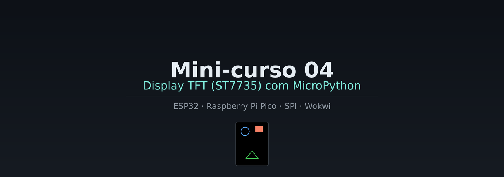

# Mini-curso 04 — Display TFT (ST7735) com MicroPython

Mini-curso para o Curso Técnico em Automação Industrial — disciplina de Sistemas Embarcados.

Este material ensina a usar um **display TFT SPI de 1.8" (driver ST7735)** com **MicroPython**, no **ESP32** (placa principal) e no **Raspberry Pi Pico** (placa secundária, indicada nos comentários `# Pico:` dentro do código). Todas as aulas podem ser simuladas no [Wokwi](https://wokwi.com), sem necessidade de hardware físico, e também podem ser reproduzidas na bancada real.

> 📌 Pré-requisito: recomendamos ter concluído o [Mini-curso 01](../minicurso-embarcados) (lógica digital e operadores bitwise) e estar familiarizado com o básico de MicroPython (variáveis, funções, laços).

## Sobre o hardware

- **Display:** TFT SPI 1.8", 128×160 pixels, driver **ST7735**
- **Biblioteca MicroPython:** [`boochow/MicroPython-ST7735`](https://github.com/boochow/MicroPython-ST7735) (testada em ESP32 e Raspberry Pi Pico)
- **Simulação no Wokwi:** o Wokwi não possui um componente nativo para o ST7735. Usamos um **chip customizado da comunidade** ([`martysweet/st7735-wokwi-chip`](https://github.com/martysweet/st7735-wokwi-chip), MIT license), referenciado como dependência no `diagram.json` de cada aula — veja a Aula 1 para o passo a passo.

## Estrutura do curso

| Módulo | Aula | Tema | Conceito-chave |
|--------|------|------|-----------------|
| 1 — Fundamentos | [1](./aulas/aula01-fundamentos-spi.md) | SPI, pinagem e primeira tela colorida | Barramento SPI, adicionar chip/biblioteca no Wokwi |
| 1 — Fundamentos | [2](./aulas/aula02-hello-world-texto.md) | Hello World — texto na tela | Fontes, cores RGB565 |
| 2 — Formas geométricas | [3](./aulas/aula03-linhas-retangulos-circulos.md) | Linhas, retângulos e círculos | Primitivas de desenho |
| 2 — Formas geométricas | [4](./aulas/aula04-triangulos-composicao.md) | Triângulos e composição de ícones | Combinação de formas |
| 3 — Gráficos dinâmicos | [5](./aulas/aula05-barra-progresso.md) | Barra de progresso / medidor | Mapeamento de valores para pixels |
| 3 — Gráficos dinâmicos | [6](./aulas/aula06-grafico-tempo-real.md) | Gráfico de linha em tempo real | Buffer de valores, "osciloscópio" simples |

Cada aula é um estudo dirigido de **~30 minutos**, com objetivos, explicação de conceito, circuito, código comentado, perguntas de experimento e desafios (principal + bônus).

## Estrutura do repositório

```
minicurso_04-embarcados/
├── README.md
├── index.md              ← página inicial (GitHub Pages)
├── _config.yml            ← configuração Jekyll (tema Cayman)
├── COMO-PUBLICAR.md        ← guia de publicação no GitHub Pages
├── aulas/
│   ├── aula01-fundamentos-spi.md
│   ├── aula02-hello-world-texto.md
│   ├── aula03-linhas-retangulos-circulos.md
│   ├── aula04-triangulos-composicao.md
│   ├── aula05-barra-progresso.md
│   ├── aula06-grafico-tempo-real.md
│   └── codigo/
│       ├── aula01_main.py
│       ├── aula02_main.py
│       ├── aula03_main.py
│       ├── aula04_main.py
│       ├── aula05_main.py
│       └── aula06_main.py
└── assets/
    ├── banner.png
    ├── wokwi-links.md
    ├── diagrams/
    │   └── diagram-tft-esp32.json   ← circuito único, igual em todas as aulas
    └── libs/
        ├── ST7735.py        ← driver (boochow/MicroPython-ST7735)
        └── sysfont.py       ← fonte de texto (5x8 px)
```

> 💡 A ligação física (TFT ↔ ESP32) é **a mesma em todas as 6 aulas** — só o código muda. Por isso há um único `diagram.json` compartilhado, em vez de um por aula.

## Publicação

Veja [`COMO-PUBLICAR.md`](./COMO-PUBLICAR.md) para o passo a passo de publicação no GitHub Pages e uso no Google Sites.

---

⚠️ **Todos os arquivos `diagram.json` estão marcados como "validar antes de publicar"** — teste cada um no Wokwi antes de disponibilizar aos alunos.
